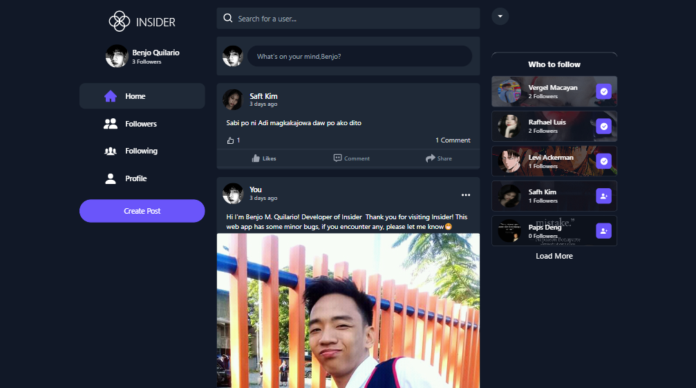
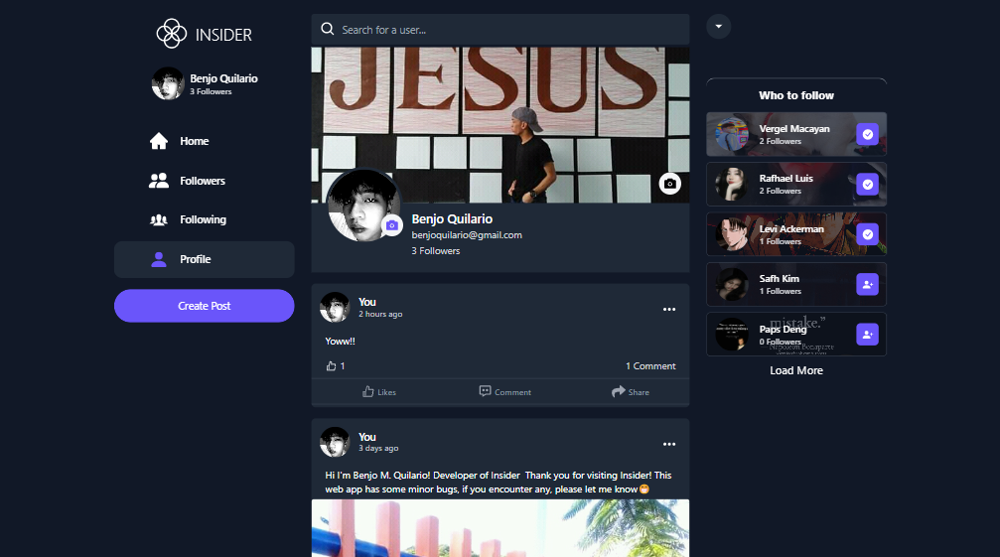

<p align="center">
  <a href="https://insider.vercel.app/">
    
  </a>
</p>

<p align="center">
  <a href="https://insider.vercel.app/">
    
  </a>
</p>

<p align="center">
<a href="https://github.com/benjoquilario/insider/blob/master/LICENSE" target="blank">

</a>
<a href="https://github.com/benjoquilario/insider/fork" target="blank">

</a>
<a href="https://github.com/benjoquilario/insider/stargazers" target="blank">

</a>
<a href="https://github.com/benjoquilario/insider/issues" target="blank">

</a>
<a href="https://github.com/benjoquilario/insider/pulls" target="blank">

</a>
</p>

<p align="center">
    <a href="https://insider.vercel.app/" target="blank">View Demo</a>
    ·
    <a href="https://github.com/benjoquilario/insider/issues/new/choose">Report Bug</a>
    ·
    <a href="https://github.com/benjoquilario/insider/issues/new/choose">Request Feature</a>
</p>

### Introducing Insider

A Fullstack **social media application** built with **_React JS_**, **_Redux_** and **_tailwindCSS_** as a frontend and **_Node Js_**, **_Express_** and **_Mongo DB_** as a backend.

## Screenshots

<a href="https://insider.vercel.app/" target="blank">
  
</a>
<a href="https://insider.vercel.app/" target="blank">
  
</a>

Try the App: [Insider](https://insider.vercel.app/)

### Features

This web app consists of a basic features/functionalities of a social media

- Login and Register
- Post CRUD functionalities
- Comment CRUD Functionalities
- Profile Customization
- Followers/Following features
- Seach Feature
- Fully Responsive

### Coming Features

- Private Messaging features
- User can only see following users posts.
- Change name functionalities
- Notification
- Dark more
- Setting page
- Reply to comments
- … and many more

## 🛠️ Installation Steps

1. Clone the repository

```bash
git clone https://github.com/benjoquilario/insider.git
```

2. Change the working directory

```bash
cd insider
```

3. Install dependencies

```bash
npm install or yarn install
```

4. Create `.env` file in root and add your variables

```bash
MONGO_URI= YOUR_MONDO_ATLAS_DATABASE_URL
SECRET_JWT= YOUR_JWT_SECRET
```

5. Run the server

```bash
npm run start or yarn start
```

6. Run the client

```bash
npm run client or yarn client
```

You are all set! Open [localhost:3000](http://localhost:3000/) to see the app.

### Technologies used

- ReactJs
- Redux
- TailwindCSS
- NodeJs
- Express
- MongoDB
- Mongoose
- Json Web Token(JWT)
- Vercel
- Heroku

## Contribution

Your ideas, translations, design changes, code cleaning, real heavy code changes, or any help are always welcome. The more is the contribution, the better it gets.

[Pull requests](https://github.com/benjoquilario/insider/pulls) will be reviewed

## Author

### Benjo Quilario

- Twitter: [@iambenjo](https://twitter.com/iam_benjo)
- Github: [@benjoquilario](https://github.com/benjoquilario)
- Portfolio: [@benjoquilario](https://benjoquilario.me)

<h3 align="center">
Insider needs a ⭐️ from you
</h3>
